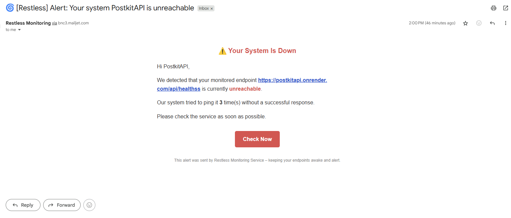

# 🌀 Restless

**Restless** is a minimal .NET 8 app that combines a background worker with a lightweight API. It keeps your APIs and web apps alive by pinging them periodically. If a service goes down, Restless sends an alert via Mailjet (free-tier email).

---

## Features

- Background service that pings URLs on a schedule
- Detects downtime based on retries and response failures
- Sends alert emails using Mailjet
- Configured via `restless-settings.json`
- Minimal HTTP API (`/`, `/health`) for liveness checks

---

## Tech Stack

**Backend**

- .NET 8 Minimal API
- BackgroundService (`IHostedService`)
- HttpClientFactory
- Mailjet SMTP (free-tier email alert)

---

## Configuration

### `restless-settings.json`

```json
{
  "Targets": [
    {
      "Name": "My Website",
      "Url": "https://example.com",
      "IntervalSeconds": 300,
      "MaxRetries": 2,
      "AlertEmail": "owner@example.com"
    }
  ]
}
```

## Sample Alert Email

Here's a preview of what the downtime alert email looks like:



## Running Locally

```
dotnet restore
dotnet run
```

End points  
-`GET /` Restless is running  
-`GET /health` Returns a simple "Healthy" message

## License

MIT

## Author

John Ronel Dela Cruz  
Full-stack Software Engineer
